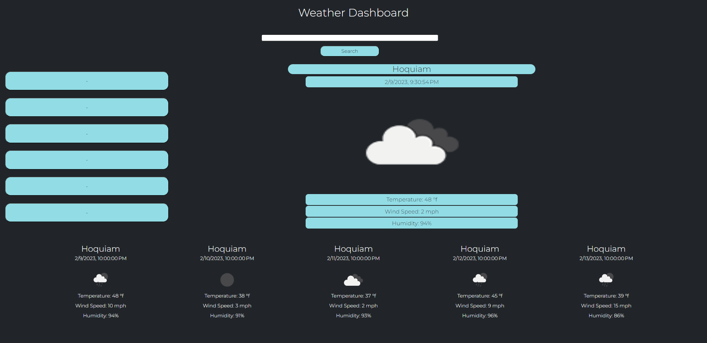

# Weather App 
# Description
This project is a weather app that takes a user input, and displays the weather data + forecast for the specified area accordingly, whenever a user searches a city it's added to the sidebar which can then be clicked to reopen the weather data for said area
# Dependencies
A web browser
# Installing 
N/A
# Executing Program
Follow the live url to the application website 
# Authors
Blayne Fuller
# License
Check github repository for the project license 
# Acknowledgements
https://openweathermap.org/api
https://htmlcheatsheet.com/js/
https://www.youtube.com/watch?v=WZNG8UomjSI
# Live URL
https://blayne-04.github.io/weather_app/
# Preview

